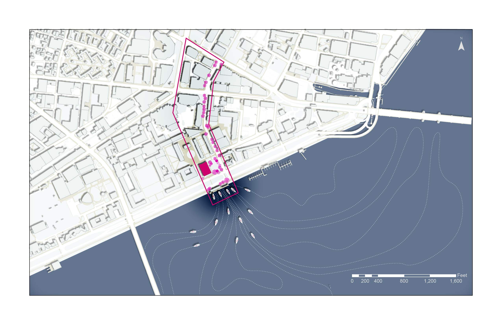
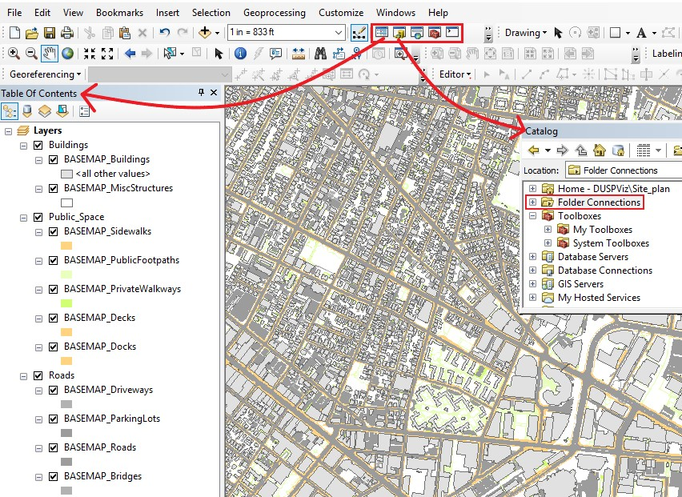
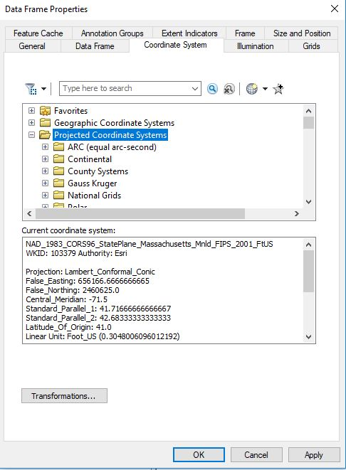
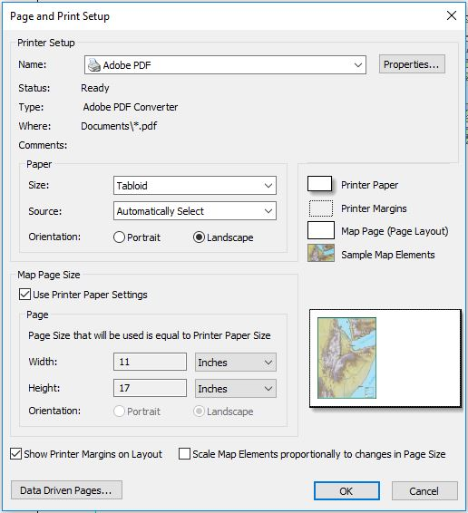
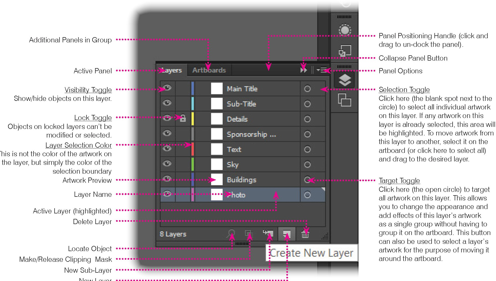
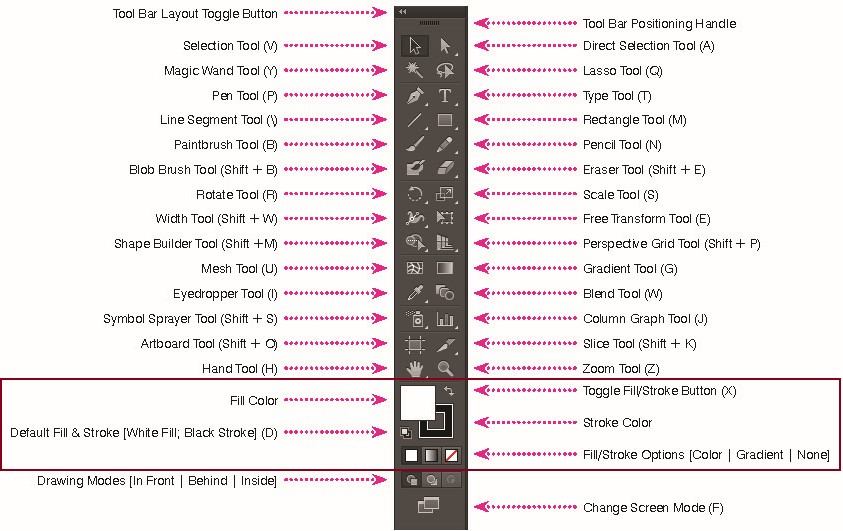
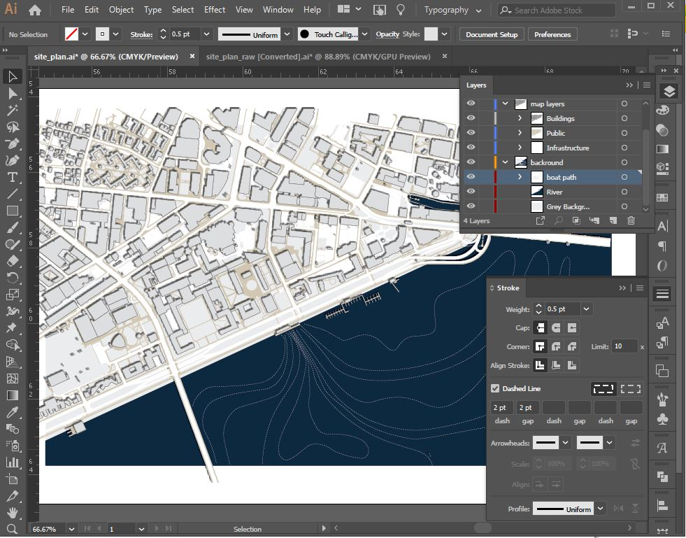

# Site Plan Design
Eric Huntley and Yael Nidam

This tutorial is a one-stop-shop for creating a compelling site plan in illustrator from raw GIS files. The first section will provide best practice advice for exporting layers from GIS to illustrator, and second part will walk through the steps of site plan design in illustrator. We assume no prior knowledge of GIS or Illustrator.

### Lab data
Download the files from: (Add link)

Alternatively, you can download the following layers directly from the [City of Cambridge GIS page](https://www.cambridgema.gov/GIS/gisdatadictionary/Basemap):

- Buildings
- Sidewalks
- PublicFootpaths
- PrivateWalkways
- Decks
- Docks
- miscStructures
- Driveways
- Parkinglots
- Roads
- Bridges

For people working on MIT machines, please copy the files to your external hard drive. If you don’t have an external hard drive you should get one as soon as possible. In the meantime, you can download the files to your C:\temp directory. Remember that this directory gets erased quite frequently and you should not leave files on c:\temp when you leave lab.

## Part One: From ArcGIS to Illustrator

### 1. Open ArcMap and add layers

1. Use **Catalog** to connect to the data folder in your computer by right clicking on 'folder connections' and choosing the path to your data folder.
2. Use **Table of Contents** to add layers from the data folder by right clicking on the layers icon in the table of Contents and adding all the layers from your data folder.

### 2. Adjust projection
While the world is round, projections are flat. It is important to choose a projection that's appropriate to your location, otherwise your drawing will look squashed.

In the Table of Content, right-click on the name of the Data Frame (in this case - layers) and choose Properties.
In the pop-up Data Frame Properties window choose the Coordinate Systems tabs. Here choose Projected Coordinate Systems -> State Plane -> NAD 1983 (CORS96) (US FEET) -> NAD_1983_CORS96_StatePlane_Massachusetts_Mnld_FIPS_2001_FtUS. Click OK.

### 3. Define layout view and bookmark
Defining a layout view is super important for 2 reasons:
1. If a specific scale is important for your map, you need to set scale and paper size in GIS.
2. If this is a work in progress and you might want to add layers in the future, this will make the process quick and easy.

Follow these steps:
1. Click on the "layout view" icon, it's the second icon to the left, located at the bottom left part of the screen.

2. Define paper size:
File -> Page and Print Setup

For this exercise, please Choose Tabloid (11X17) paper size in landscape orientation. Check the box for 'Use Printer Paper Settings'.

3. Use guides to frame your document by clicking on a ruler. ( if you don't see rulers, add them through View->Rulers). Adjust the map frame according to guides. Use 1 inch margins.

4. Define scale and final view. The scale bar is located at the top. You can use the pan command (hand icon) to move the map within the frame. Add scale to your map and place it outside the map frame. Insert-> Scale Bar.

5. Create Bookmark!
Bookmarks -> Create Bookmarks -> Choose a descriptive name.
This process will help you go back to the same view if you need to export additional layers to the same illustrator file.

6. Add scale and north arrow from the insert tab.

### 5. Export to Illustrator.
Check that all the layers you need are turned on and that you like how you set the view.
File -> Export Map -> Choose location and name, make sure the file type is AI!

## Part Two: Illustrator Editing and Design
For a comprehensive introduction to the Illustrator interface, check out the [Intro to Adobe Illustrator tutorial](http://duspviz.mit.edu/tutorials/adobe-illustrator/). The following site plan tutorial will introduce you to a workflow to produce a site plan, using common illustrator tools.

Navigation Shortcuts:
**Zoom IN** Ctrl/Cmd + "+" OR hold Alt/Opt + mouse scroll wheel "up"
**Zoom Out** Ctrl/Cmd + "-" OR hold Alt/Opt + mouse scroll wheel "down"
**Pan up** mouse scroll wheel "up"
**Pan down** mouse scroll wheel "down"
**Pan left** hold Ctrl/Cmd + mouse scroll wheel "up"
**Pan up** hold Ctrl/Cmd + mouse scroll wheel "down"
**Pan up** hold spacebar + mouse click-and-drag

### 1. Prepare Layers for Editing
This stage will introduce the layers panel.

*Adapted from the [Intro to Adobe Illustrator tutorial](http://duspviz.mit.edu/tutorials/adobe-illustrator/)*

- **Layers: Clipping Mask**
  Open the layer panel (window -> Layer).
  you'll see the results of exporting a file from GIS to Illustrator:
  - Each GIS layer has been converted to an Illustrator layer with the same name.
  - Each layer contains a clipping mask, that hides the full extend of the polygons exported, to show only those that fit into the frame.

  In order to edit the layers, you can either:
  - Delete the clipping mask by dragging it into the bin at the bottom right of the layers panel. After this action you'll see the full extent of the polygons exported (outside of the frame).
  - Lock the clipping mask by clicking on the lock icon next to the layer. After this action the polygons will still be masked, but you'll be able to edit their properties.

- **Type: Legacy Text**
  In the top panel choose Type -> Legacy Text -> Update All Legacy Text

### 2. Edit Layers
This stage will introduce the fill/stroke tool the tools panel.

*Adapted from the [Intro to Adobe Illustrator tutorial](http://duspviz.mit.edu/tutorials/adobe-illustrator/)*

- **Layers**
  This step will make editing easy by grouping layers that will have the same color and stroke.

    - Group layers
    layers panel -> 'create a new layer' (icon at the bottom right of the panel)
    Create three new layers and name them: Buildings, Public, and infrastructure. (Double click on the layer's name to rename it).
    - Order layers
    Layer Order matter! Illustrator stacks successively drawn objects, beginning with the first object drawn.
    Drag the layers you exported from GIS into their new groups, and reorder them from top to bottom as follows:
    1. Buildings (Buildings, miscStructures)
    2. Public (Sidewalks, PublicFootpaths, PrivateWalkways, Decks, Docks)
    3. infrastructure (Driveways, Parkinglots, Roads, Bridges)

- **Tools: Fill/Stroke**
  The fill color tool is the rectangle at the bottom of the tools panel that controls the fill color of the polygon.
  The stroke tool is the hollow rectangle at the bottom of the tools panel that controls the stroke/border color of the polygon. stroke weight and type can be adjusted in the top panel.
  You can toggle between the fill color and stroke tools by using the small arrow or the 'x' hot key.

  In this step, you will change the color and stroke of the layers as follow:
    - Buildings: Fill color: DDDDDD, Stroke: 707071, stroke weight: 0.5.
    - Public:  Fill color: D2C6B2, Stroke: None.
    - infrastructure:  Fill color: FFFFFF, Stroke: None.

  Follow this workflow to edit the layers, one by one:
    1. click on the Layer's circle in the layer's menu to select all polygons.
    2. Use the Fill/Stroke tool to set Fill/Stroke.
      Select the tool by clicking on it and double click on it to select color.
    3. If you added stroke, you will see a stroke bar at the top panel.
    Click on the word Stroke, a new pop up window will open where you can adjust line type. Next to the word stroke is the line weight, it usually defaults to 1pt, adjust as needed. Another way to reach the stroke menu: window -> Stroke.
    4. Lock layer by clicking on the right box next to the layer's name. You will see a lock icon populating the box.

- **Shadow Effect**
1. In the layers panel-> choose all polygons in the 'building' group by clicking on the group's circle.
2. In the top panel-> Effect -> Stylize -> Drop Shadow.
3. X offset: -0.05. Y offset: -0.05. Blur: 0.05.
4. Repeat process for the 'bridges' and 'docks' layers.

### 2. Add Background
This stage will introduce the rectangle and pen tools in the tools panel.

**Layers**
1. In the layers panel->
    - Create a new layer and name it 'background'.
    - Create a new layer and name it boat path. Drag 'boat path' into background.
Drag 'background' to the bottom of the layers panel.
Click on the background layer once, the layer will be highlighted and all new objects will be created in this layer.

**Tool: Rectangle (M)**
2. In the tools panel -> Use the rectangle tool to draw a rectangle the size of the drawing frame. The rectangle layer will be hosted under the background layer, name it 'grey background', Change the fill color to: EAEAEA.

**Tool: Pen (P)**
3. In the tools panel -> Use the pen tool to draw a polygon where the river should be.
    - To draw straight lines -> click to indicate where the next node should be.
    - To create curvy lines -> Click and drag.
Name the new layer 'river', change fill color to:0D2A3F, place above 'grey background'.

4. In the layers panel - choose the 'boat path' layer.
 In the tools panel -> Use the pen tool to draw several polygons to indicate boat paths on the water. All lines should start at the MIT Sailing Pavilion. Fill color should be empty, stroke color: white.  

**Stroke**
In the stroke panel (window-> Stroke) stroke type: dashed line, dash: 2pt, gap: 2pt.

At the end of this stage your image should look like this:

### 3. Design Site Diagram
This stage will introduce the select, ellipse, image tracing, and feather tools. For practice purpose, the design will highlight Ames street as a connection to the sailing pavilion. As a design strategy, background colors are mute, while intervention colors are bright.

**Tool: Select (V)**
1. In the tools panel -> Choose select (black arrow on top), and select the Muddy Charles's Building.
Right click -> Arrange -> Bring to Front.
This command will send this polygon to the top of the Buildings layers.

2. In layers panel ->
  - create a new layer named 'diagram' and drag to the top.
  - Go to the buildings layer and select the 'Muddy Charles' polygon.
  - Duplicate layer by dragging it to the 'create new layer' icon at the bottom right of the layers panel.
  - Drag the duplicated layer to the 'diagram' layer, and change color to C61E53.

**Tool: Pen (P)**
1. In the layers menu -> choose 'diagram'.
2. Use the pen tool to draw the intervention area as shown at the top pf the page. Fill: empty. Stroke: C61E53, weight: 2pt.

**Tool: Ellipse (L)**
1. In layers panel -> create a new layer named 'trees' and drag into 'diagram'. Choose the 'trees' layer by clicking on it once.
 In the tools panel -> choose ellipse (long click on the rectangle icon will open a menu of shapes).
2. Use shift to create a perfect circle.  Fill: C61E53. Stroke: empty. Opacity: 50%.

**Tool: Select (V)**
 1. select tool -> Select the pink ellipse and use controls to change its size.
 2. select tool + Alt key -> duplicate shape.
 3. Use the select tool to create a tree avenue on aims street that leads to the Muddy Charles. make sure all new 'trees' are created in the 'trees' layer.

 **Image Tracing**
  This process will convert an image to a vector file, that you can then further edit in Illustrator.

 1. In the layers panel -> create a new layer, name it 'boats' and drag it into the diagram layer.
 2. Use internet search services to find an plan-view image of a small boat. Save image to the project file and then drag into the illustrator artboard. drag image to the 'boats' layer.
 3. Use the select tool to click on the image, a tracing menu will appear at the top panel.
 4. Duplicate image before tracing, since tracing is reversible only by ctrl + Z.
 5. From the top panel -> Image Trace-> 16 colors (recommended, but you can test other options to get a better understanding of the tool).
 6. After Tracing is complete and you are happy with the result, click on 'Expend' in the top panel. This action will convert the image into an illustrator layer and all the polygons will be hosted under this layer.
 7. Edit the tracing result by deleting unnecessary polygons and adjusting fill and stroke colors to match the site plan image.
 8. use the select tool to resize the image and place it in the river, on top of one of the boat paths. Duplicate boat image and add boats on other paths.

**Feather**
  We'll use this effect to focus attention on the intervention area by dimming the background.

1. In the layers panel-> create a new layer, name it 'frame' and drag to the top. Click on the layer to choose it.
2. Use the rectangle tool to draw a rectangle, larger than the size of the entire artboard.
3. Duplicate the site intervention border and drag the copy to the 'frame' layer. place this shape below the rectangle.
4. Choose both shapes by holding Ctrl/Cmd and clicking on the layer's circle in the layers panel.
5. You can deduct the intervention shape from the rectangle shape in two ways:
  - In the artboard space, right click and choose: make compound path. This action will maintain the proportions of the two shapes separately, so you can later resize the rectangle without changing the proportions of the intervention area.
  - Window -> Pathfinder, choose 'minus back'. This action will join the two shapes into one, and any size changes will apply to both shapes.
6. Change fill color to white, stroke empty.
6. From the top panel -> Effects -> Stylize -> Feather, click on preview and choose the feather value that fits best.
7. Change Opacity to 50%.
