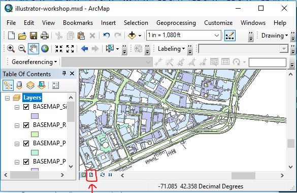
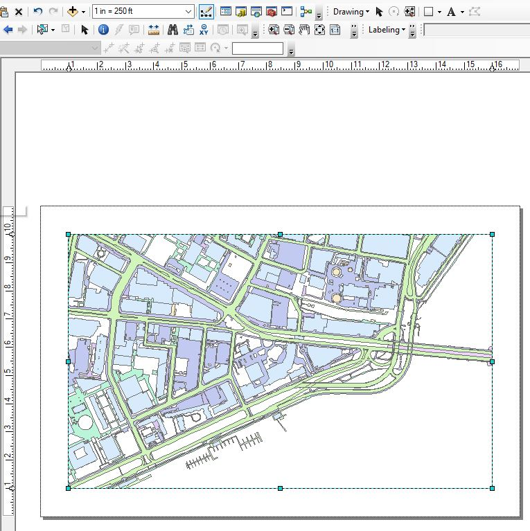
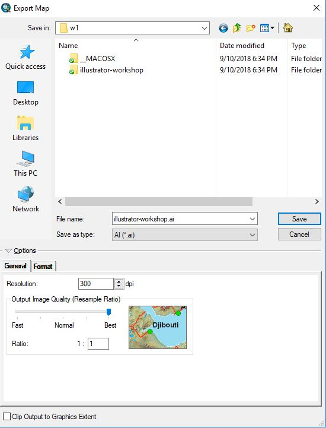
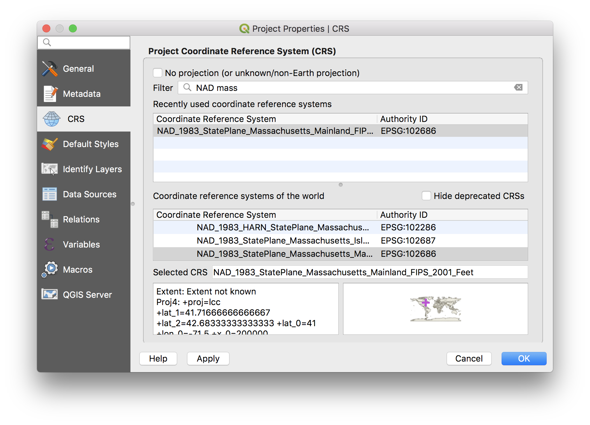
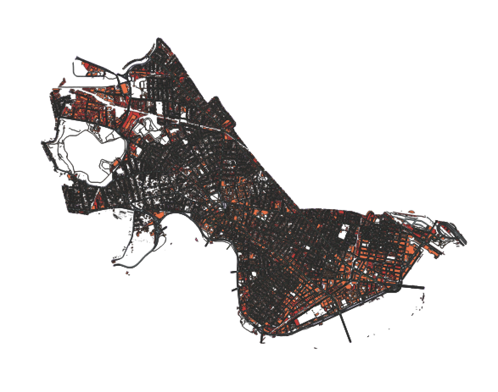
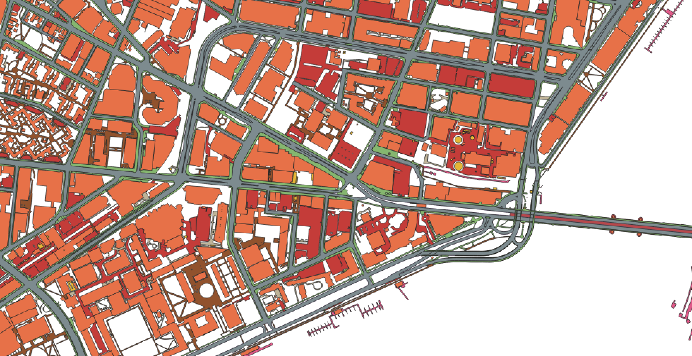

# Week 01: From GIS to Illustrator

Eric Huntley and Yael Nidam

Over the next few weeks, we'll be introducing basic design workflows, beginning from GIS data and drawing as well as modeling with that data using 3D modeling software and the industry standard Adobe suite.

Why is this important and valuable? In the bad old days, urban and architectural drawings, even revisions of drawings, involved manually tracing plat maps and surveying documents. Even with CAD software, we often see architects meticulously tracing building footprints before beginning to model a site. We want to emphasize that in many cases this is totally unnecessary; if you have GIS data, you have much of your modeling legwork done for you!

We'll be starting slow - this workshop will introduce a fairly straightforward workflow for getting GIS data loaded into Adobe Illustrator. But even this is an enormous time-saver!

## Getting Lab Data

First, download the files from [Eric's Public Athena locker](mit.edu/ehuntley/Public/illustrator-workshop.zip). This will contain

Please copy the files to your external hard drive. If you don’t have an external hard drive you should get one as soon as possible. In the meantime, you can download the files to your `C:\temp` directory. Remember that this directory gets erased quite frequently and you should not leave files on `c:\temp` when you leave lab.

The unzipped file contains ArcGIS and QGIS files and the GIS layers we will be using today.

## Using ArcGIS...

### 1. Open File

We've provided an ArcGIS file named `illustrator-workshop.mxd` - open it! Note that this file contains a range of GIS data for Cambridge, MA, drawn from the [City of Cambridge GIS](https://www.cambridgema.gov/GIS/~/link.aspx?_id=F892749D57E84BADAA2BB581E03B7E8D&_z=z). For the curious, check out the [Data Dictionary](https://www.cambridgema.gov/GIS/gisdatadictionary/Basemap).

Note that this data is also available [on GitHub](https://github.com/cambridgegis/cambridgegis_data)... however, on GitHub spatial data is stored in the GeoJSON data format which ArcGIS doesn't read. However, QGIS (below), handles it quite nicely. We'll be discussing this later.

### 2. Adjust Layers

If you open the file and can see the layers, simply _skip to the next step_.

However, if some or none of the layers are visible and you see a red exclamation mark next to the Layer's name, it means that the connection between the file you're working on and the referenced shapefile is broken. To repair this problem, right-click on one of the files in the TOC, and click “Data” and then select “Repair Data Source…” and navigate to the file which should be in the Data folder.

### 3. Adjust Projection

While the world is round, maps and screens and plans are flat. It is important to choose a projection that's appropriate to your location, otherwise your drawing will look squashed.

In the Table of Content, right-click on the name of the Data Frame (in this case - layers) and choose Properties.
In the pop-up Data Frame Properties window choose the Coordinate Systems tabs. Here choose Projected Coordinate Systems -> State Plane -> NAD 1983 (CORS96) (US FEET) -> NAD_1983_CORS96_StatePlane_Massachusetts_Mnld_FIPS_2001_FtUS. Click OK.

### 4. Define Layout View and Bookmark

Defining a layout view is very important for 2 reasons:

1. If a specific scale is important for your map, you need to set scale and paper size in GIS.
2. If this is a work in progress and you might want to add layers in the future, this will make the process quick and easy.

Follow these steps:

1. Click on the "layout view" icon, it's the second icon to the left, located at the bottom left part of the screen.

2. Define paper size:
File -> Page and Print Setup

For this excercise, please Choose Tabloid (11X17) paper size in landscape orientation. Check the box for 'Use Printer Paper Settings'.

3. Use guides to frame your document by clicking on a ruler. ( if you don't see rulers, add them through View->Rulers). Adjust the map frame according to guides.

4. Define scale and final view. The scale bar is located at the top. You can use the pan command (hand icon) to move the map within the frame. Add scale to your map and place it outside the map frame. Insert-> Scale Bar.

5. Create Bookmark!
Bookmarks -> Create Bookmarks -> Choose a descriptive name.
This process will help you go back to the same view if you need to export additional layers to the same illustrator file.

### 5. Export to Illustrator.
Check that all the layers you need are turned on and that you like how you set the view.
File -> Export Map -> Choose location and name, make sure the file type is AI!

## Using QGIS...

### 1. Open File

Open the QGIS file named `illustrator-workshop.qgs`. Like the above ArcGIS project file, this contains a range of GIS data for Cambridge, MA, drawn from the [City of Cambridge GIS](https://www.cambridgema.gov/GIS/~/link.aspx?_id=F892749D57E84BADAA2BB581E03B7E8D&_z=z). Note that, though it may not be obvious, we're using different files here! QGIS (unlike Arc) can read the GeoJSON files hosted [on GitHub](https://github.com/cambridgegis/cambridgegis_data).

### 2. Adjust Projection

While the world is round, projections are flat. It is important to choose a projection that's appropriate to your location, otherwise your drawing will look squashed, as it does when you first open it.

In the Project dropdown menu, select `Properties`. In the prompt that appears, select the `CRS` (coordinate reference system) tab, and search for `NAD_1983_StatePlane_Massachusetts_Mainland_FIPS_2001_Feet` (i.e., `EPSG 102686`). For reference, your screen should look like this...

And your map should look something like this...

### 4. Define Layout View and Bookmark

1. Zoom to the portion of Kendall Square adjacent to the Longfellow Bridge (e.g., something like the above).
2. Bookmark this view so you can come back to it later! `View > New Bookmark` - this will save you a ton of agony if you need to produce a new map or plan of this same map extent!
3. Select `Project > New Print Layout` - call it something like "Kendall".
4. Add a new map to the layout using the button that looks like an unfolding scroll with a plus sign along the left side.
5. Add a scale bar and a legend - these will be useful when are making our final map in Illustrator.

### 5. Export to Illustrator.

Unlike ArcGIS, QGIS doesn't support exporting directly to AI files; instead, we'll export to a PDF, which we can then read into Illustrator!
