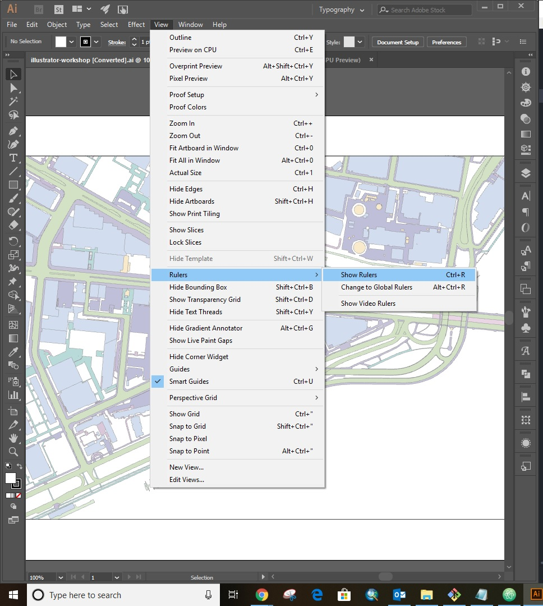
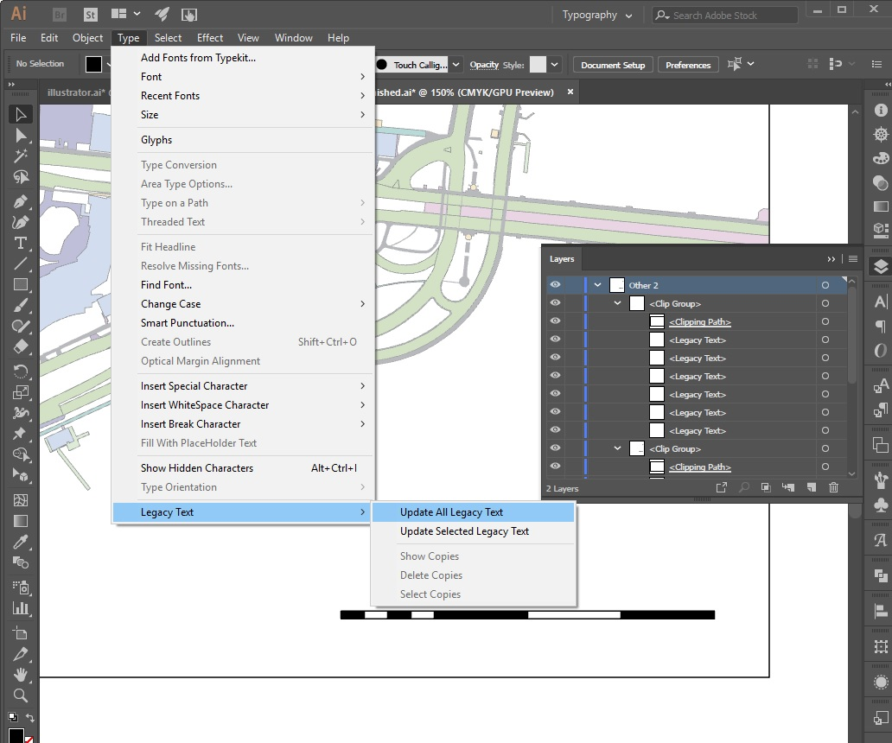
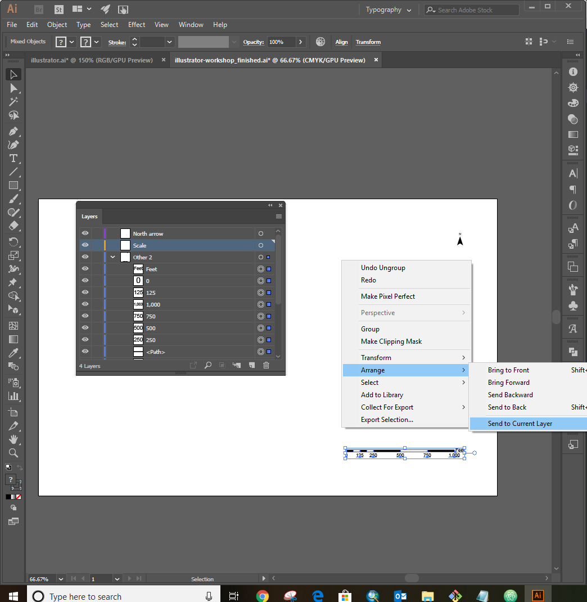
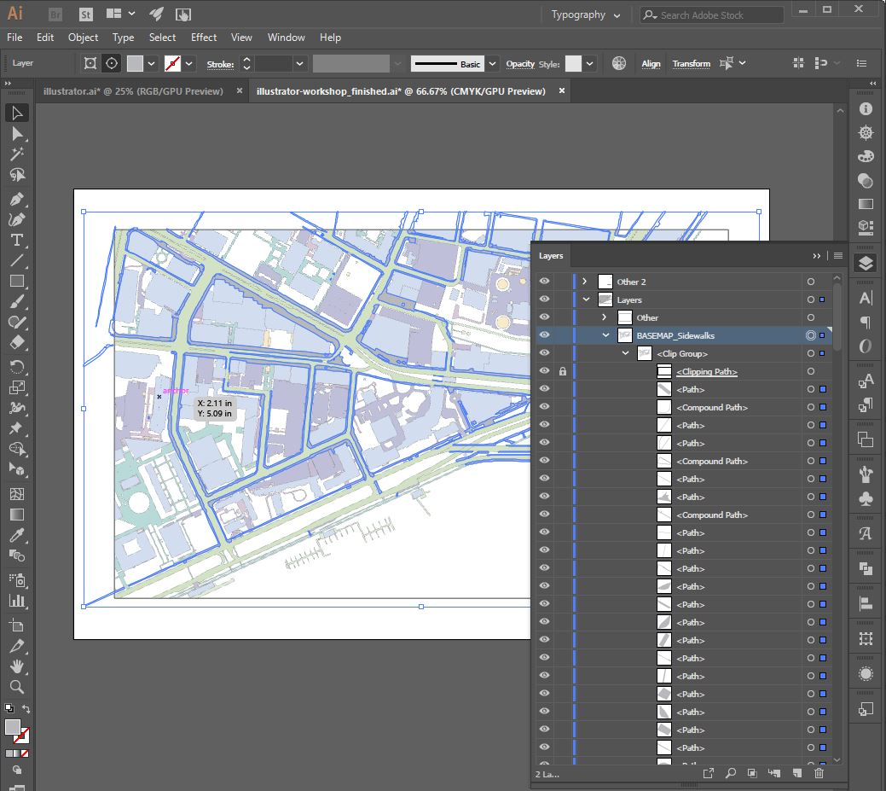
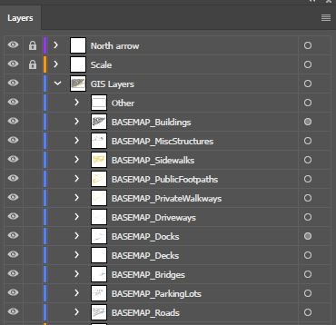
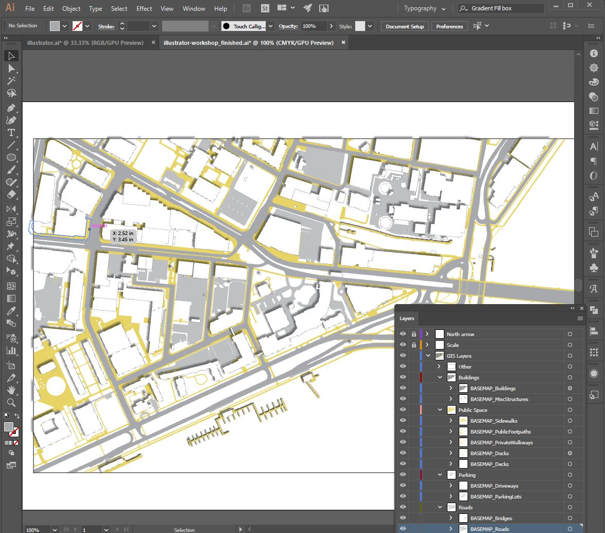
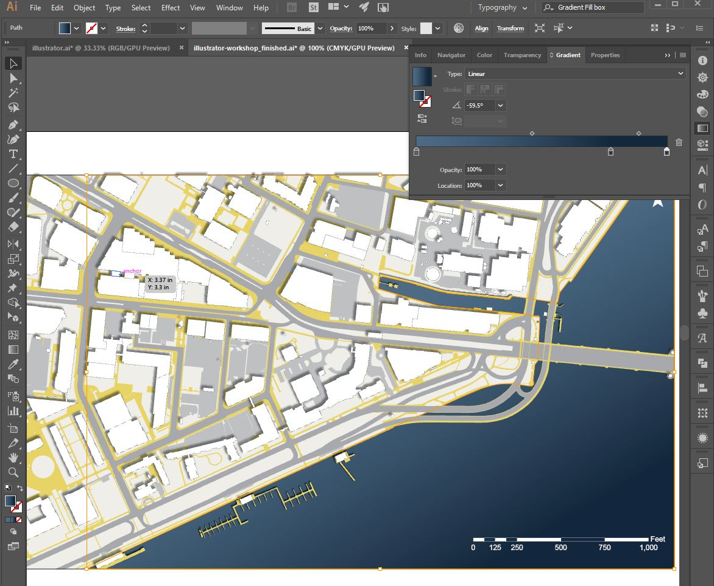
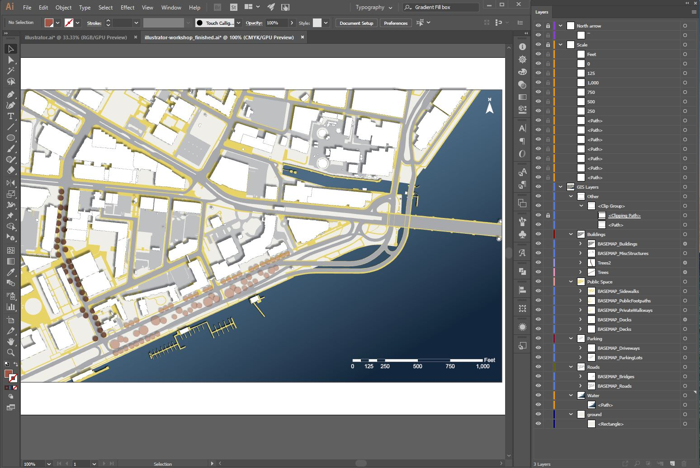

# Illustrator Site Map

Eric Huntley and Yael Nidam
(add image)

### File for This Exercise
Open the Illustrator file you exported from ArcMap or QGIS.
Alternatively, download the file we exported for you from here.

## Checkout Paper Size and Margins

### 1. Add Rulers
In the top panel: View -> Rulers -> Show Rulers

### 2. Name Artboard
In the left panel, press on the artboard icon, this will change the top bar to artboard editing. Here you can edit the W (width) and H (Hight) measurements, name your artboard and create more artboards as necessary. To get back to the selection menu click on the top arrow on the left panel (shortcut - v).

## Clean layers

### 1. Adjust text
Text exported from GIS to illustrator needs to be converted.
In the top panel: Type -> Legacy Text -> update all legacy text.

### 2. Organize layers
GIS exports every layer to a different illustrator group. For none-layers elements, grouping is not always helpful and needs editing. In this case, we will reorganize the north arrow and scale elements. Follow these steps:
1. For housekeeping purposes, change the name of 'layers' to 'GIS Layers'. Now, turn this layer off by clicking on the eye icon next to the layer.
2. Create 2 new layers: 'North Arrow' and 'Scale', by clicking on the 'create new layer icon' at the bottom right of the layers window, second from the right.
3. Checkout layer 'other 2' where currently the north arrow and scale geometry is stored and delete the 'Clipping Path' by dragging it to the bin at the bottom corner of the layer window.
4. Choose layer 'other 2', hover over the selected area and right click, choose ungroup (shortcut: Ctrl + Shift + G).
5. In the artboard space, select the scale elements. Afterwards, go ton the layer menu and Select the layer 'scale' you just created.  In the artboard space, right click and choose arrange - > send to current layer. Do the same for the arrow.

6. 'Other 2' layer should be empty now, erase it by dragging it to the bin at the bottom right of the layer window.
7. Turn on 'GIS layers'.

### 3. Lock 'Clipping Path'
Layers exported from GIS to illustrator are groups of line work and 'Clipping Path. Since illustrator reads the 'Clipping Path' as an additional geometry, we will need to lock this layer so we can edit the geometry without changing the frame.
Go to the layers panel, Open each of the groups under 'GIS layers' and lock the 'Clipping Path by checking the box next to the eye icon of that layer.

### 4. Layer order
Layer order is significant in illustrator, since the top layer covers and hides the layers underneath it. Reorder the layers to match the following image:

### 5. Group layers that will be colored the same way
In 'GIS Layers', under 'other', create 4 new layers: 'Buildings', 'Public Space', 'Parking', 'Roads'. Drag appropriate GIS layers into these new groups.

## Adjust line weight and color
Under GIS layers, we'll choose each group independently to edit fill color and line stroke & color.
To choose a layer/group, go the layers menu and click on the circle to the right of the layer name.
To adjust colors, use the fill & stroke icons At the bottom of the left panel. There are two squares: the top left is fill, the bottom right is stroke.

### Buildings
1. 'Buildings' - fill color white, stroke black, stroke weight 0.25.
2. Add shadow - Effect -> Stylize -> Drop Shadow.

### Public Space
1. fill color #E8D267, stroke none.
2. Add shadow to docks.

### Parking
fill color #B5B5B5, stroke none.

### Roads
1. fill color 999999, stroke none.

2. Adjust 'BASEMAP_Roads' layer:
Go back to the layer menu and look at layers under the group 'BASEMAP_Roads'. You'll find most of the layers are 'path' and only two of them are 'Compound Path'. Drag the two 'Compound Path' to the top of the group under the Clipping Path' and lock them. Next select all layers in the 'BASEMAP_Roads' group by clicking on the circle on the right hand side and type 'Ctrl+G', this will create a new group, double click on it to name it 'roads2'. turn this group off.

### Mid-result

## Add ground and water

1. In the layer menu, under 'Roads', add 2 layers:
'Ground', 'Water'.

2. Choose Ground - go to the left panel and select the rectangle tool (shortcut - m). Draw a rectangle the size of the frame. Fill color #EFEDE6, stroke none.

3. Choose Water - Go to the left panel and choose the pen tool (shortcut - p).
draw the contour of the water. Fill color #14283D, stroke none.

4. Create Gradient for the water color:
- Open the gradient tool: Window -> Gradient
- Choose type: linear.
- Choose colors for each of the gradient buckets.

## Add Trees
1. In the layer menu, create new layer 'trees'. Choose the layer and adjust opacity to 40%.
2. In the left panel, choose the ellipse tool (L) and draw a circle the size of a tree. Fill color #A15443, stroke #4C211C.
3. Add shadow.
4. Sprinkle trees on the plan.
5. To highlight a specific area, you can create a new layer, in this case 'trees2', with slightly darker trees.

## Print
