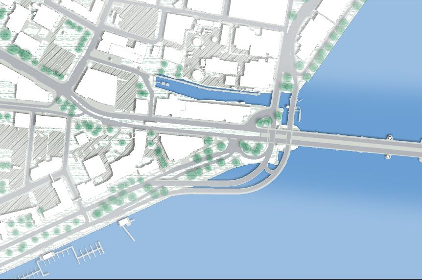
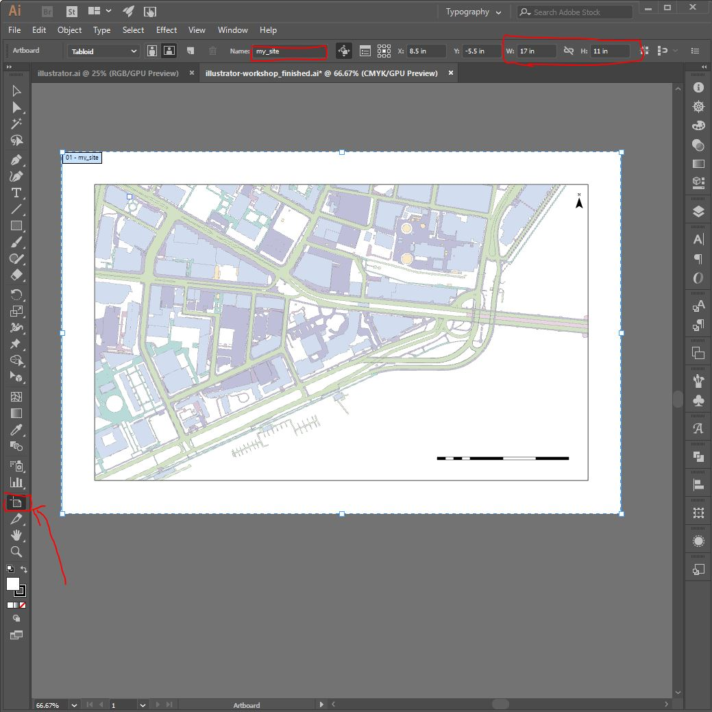
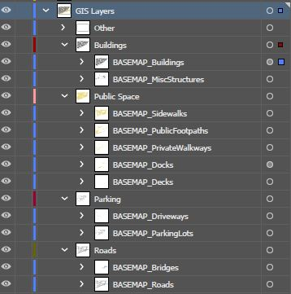
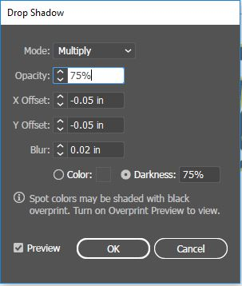
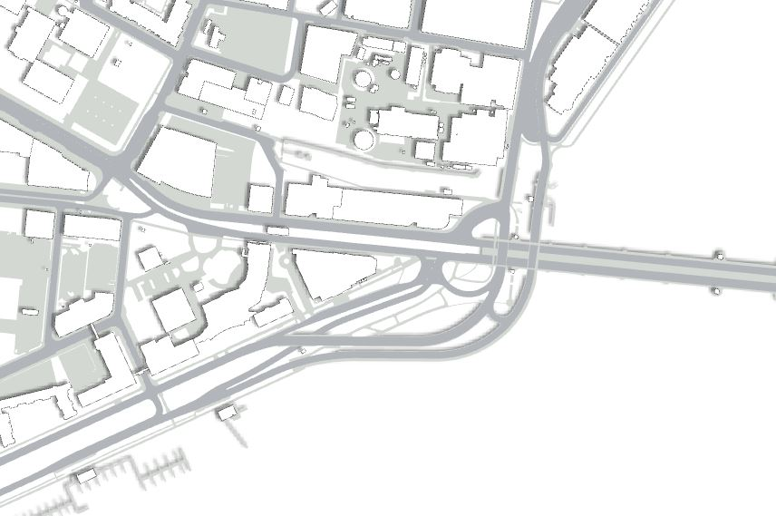
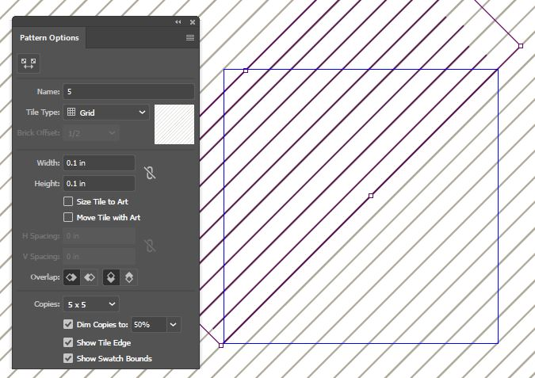

# Illustrator Site Map

Eric Huntley and Yael Nidam

### File for This Exercise
Open the Illustrator file you exported from ArcMap or QGIS.
Alternatively, download the file we exported for you from here.

## Setup Workspace

### 1. Add Rulers
In the top panel: View -> Rulers -> Show Rulers

### 2. Name Artboard
In the left panel, press on the artboard icon, this will change the top bar to artboard editing. Here you can edit the W (width) and H (Hight) measurements, name your artboard and create more artboards as necessary. To get back to the selection menu click on the top arrow on the left panel (shortcut - v).

## Clean layers

### 1. Adjust text
Text exported from GIS to illustrator needs to be converted.
In the top panel: Type -> Legacy Text -> update all legacy text.

### 2. Organize layers
GIS exports every layer to a different illustrator group. For none-layers elements, grouping is not always helpful and needs editing. In this case, we will reorganize the north arrow and scale elements. Follow these steps:
1. For housekeeping purposes, change the name of 'layers' to 'GIS Layers'. Now, turn this layer off by clicking on the eye icon next to the layer.
2. Create 2 new layers: 'North Arrow' and 'Scale', by clicking on the 'create new layer icon' at the bottom right of the layers window, second from the right.
3. Checkout layer 'other 2' where currently the north arrow and scale geometry is stored and delete the 'Clipping Path' by dragging it to the bin at the bottom corner of the layer window.
4. Choose layer 'other 2', hover over the selected area and right click, choose ungroup (shortcut: Ctrl + Shift + G).
5. In the artboard space, select the scale elements. Afterwards, go to the layer menu and Select the layer 'scale' you just created.  In the artboard space, right click and choose arrange - > send to current layer. Follow the same process to send the arrow icon to the layer 'North Arrow'.
6. 'Other 2' layer should be empty now, erase it by dragging it to the bin at the bottom right of the layer window.
7. Turn on 'GIS layers'.

### 3. Lock 'Clipping Path'
As previously mentioned, each GIS layer corresponds to a group in illustrator. These groups have the same name as the GIS layer and include:
lines, polylines and a 'Clipping Path'. The 'Clipping Path' isn't a GIS geometry, but a frame that crops the geometry to the boundary we defined in GIS. Since illustrator reads the 'Clipping Path' as an additional geometry, we will need to lock this layer so we can edit the geometry without changing the frame.
Go to the layers panel (Window->layers), Open each of the groups under 'GIS layers' and lock the 'Clipping Path by checking the box next to the eye icon of that layer.

### 5. Group layers that will be colored the same way
To speed up the design process, it's helpful to group elements that will have the same fill and stroke. For the purpose of this exercise, go to the layers window and choose 'GIS Layers'. Under 'other', create 4 new layers: 'Buildings', 'Public Space', 'Parking', 'Roads'. Drag appropriate GIS layers into these new groups.

Make sure to notice the layer order! Stacking order affects how objects are displayed when they overlap.

## Adjust line weight and color
Under GIS layers, we'll choose each group independently to edit fill color and line stroke & color.
To choose a layer/group, go the layers menu and click on the circle to the right of the layer name.
To adjust colors, use the fill & stroke icons At the bottom of the left panel. There are two squares: the top left is fill, the bottom right is stroke.

The following fill and stroke colors are suggestions, feel free to experiment with different colors.

### Adjust 'BASEMAP_Roads' layer:
Go back to the layer menu and look at layers under the group 'BASEMAP_Roads'. You'll find most of the layers are 'path' and only two of them are 'Compound Path'. Drag the two 'Compound Path' to the top of the group under the Clipping Path' and lock them. Next select all layers in the 'BASEMAP_Roads' group by clicking on the circle on the right hand side and type 'Ctrl+G', this will create a new group, double click on it to name it 'roads2'. turn this group off.

## Add Shadow
1. Choose the building layer.
2. Add shadow - Effect -> Stylize -> Drop Shadow.

3. Repeat similar process to add Shadow to the docks layer.

### Mid-result

## Add ground and water

1. In the layer menu, under 'Roads', add 2 layers:
'Ground', 'Water'.

2. Choose Ground - go to the left panel and select the rectangle tool (shortcut - m). Draw a rectangle the size of the frame. Define fill color as you like and stroke none.

3. Choose Water - Go to the left panel and choose the pen tool (shortcut - p).
draw the contour of the water. Define fill color as you like and stroke none.

4. Create Gradient for the water color:
- Open the gradient tool: Window -> Gradient
- Choose type: linear.
- Choose colors for each of the gradient buckets.
- adjust gradient line to fit the desired direction.

## Add Trees
### Using shapes
1. In the layer menu, create new layer 'trees'. Choose the layer and adjust opacity to 40%.
2. In the left panel, choose the ellipse tool (L) and draw a circle the size of a tree. Define fill color and stroke.
3. Add shadow.
4. Sprinkle trees on the plan. Choose the object you want to copy and use alt + left click while hovering over the object. drag the copied object to the desire location.
5. To highlight a specific area, you can create a new layer, in this case 'trees2', with slightly darker trees.

### Using Pen
1. Go to the layer menu - > Create a new group called 'tree3' and place in 'GIS Layers' above 'public space'.
2. Choose the pen tool (shortcut -P)
3. Lock all other layers so you wouldn't unintendingly change them.
4. Create a path where you would like to locate a tree line, define fill=none and stroke=color of your choice.
5. Go to the stroke window (window->stroke)
6. Check the box for Dashed line and define dash=0.1 and gap=20, weight=14.

7. After you have an initial line you can add more sections by using the pen tool and click on the end point of the line and continue drawing. You can also edit the shape of the line by changing editing the control points. Pen + (-) deletes anchor point, pen + (+) adds anchor point. Shift+C changes the angle.
8. You can cut any shape into segments using the scissors (shortcut c).

## Add Texture
Lets add texture to the ground.
1. In the layers menu, choose the ground layer and duplicate it by dragging it to the 'new layer' icon at the bottom right of the layers menu (next to the bin).
2. Name the duplicate 'ground texture' and choose it by clicking on the circle icon next to the layer.
3. Go to window ->Swatches
4. To choose a texture from the swatch library click on the 'Swatch Library Menu' icon at the bottom left of the swatch window.
5. To prepare your own texture, follow these steps:
- click on 'create new swatch' icon at the bottom right of the swatch menu (next to the bin), name your swatch.
- Choose the new swatch and click on the 'edit swatch' icon.
- A new window will pop with pattern options. In this window you can define the tile's shape and size.
- In the tile area draw the geometry you want to create as a pattern. Define line weight and color.
- When you're done, exit this menu by clicking 'done' at the top left bar.

## Highlight area by dimming background
1. Create new layer called dim and place at the top.
2. In this layer create 2 shapes:
- A rectangle that covers the entire area of the drawing.
- A smaller circle/rectangle/shape around an area you want to highlight.
3. Choose both layers and right click -> Choose create compound path.
4. Choose fill = white and stroke black. Change opacity to 70%.
