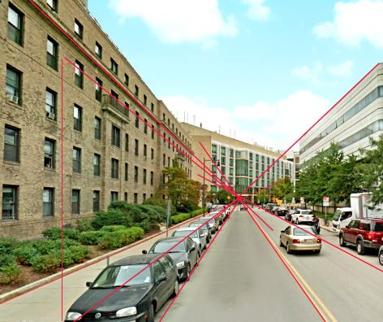
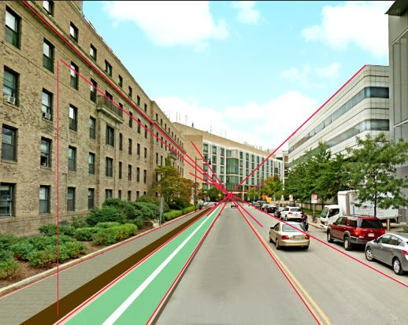
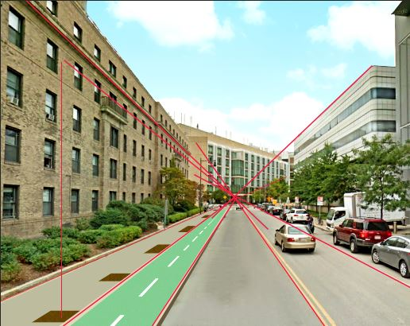
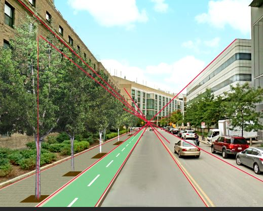

# Photoshop render
Eric Huntley and Yael Nidam

This tutorial will introduce you to rendering technics in photoshop that will help tell a compelling story about your images.

### File for This Exercise
You can follow this tutorial using any image you like, or download the images used in this tutorial from here:
You can also download the final PSD file from here:

## Basic shortcuts for tools used in this tutorial
Tools on the left panel:

Move = v
Rectangle Marquee  = m
Lasso = l
Magic wand = w
Crop = c
Clone = s
Eraser = e
Gradient = g
Pen = p
Line = u

Addionally, every tool you choose will have a different top bar where you can make adjustment to how you use the tool.
To start, let's set the move tool bar - uncheck the auto-select. For now we will use the layer menu to select layers we wish to work on. We can still select images manually by pressing the control button and left-clicking above the image we want to select.

## 01 Improve Image Quality
Sometimes the only images available to us are of low quality, that doesn't mean we cannot produce great images! Follow these steps to improve the quality of the image:

### 1. Use Skew to Adjust Perceptive
Images taken from google earth can have twisted perspectives. One way to correct a perspective is to use the skew tool. First make sure the rulers are on (view ->Rulers). Next, press on control and drag a guide line from the edge of the vertical ruler. place the guideline next to a line in the image that should be vertical but isn't, like the window line. Lastly, using the move tool (v), choose the image, check the box to show transform controls at the top bar and press skew to change the location of the vertex so that the perspective will be more similar to normal pictures.

### 2. Use Clone to Remove Street Name
The clone tool paints with pixels from another part of the image. We will use this tool to paint over the street name with road pixels from adjucent area.
- Choose the clone tool (s) and right click to choose a soft edges brush and adjust brush size.
- Alt+click to define the area you wish to clone.
- click on the area you wish to paint over.

### 3. Shadow-highlights
This effects enables editing of the shadows and highlight of the image.
Image ->Adjustments -> Shadow/Highlights

### 4. Sharpen
This filter will make the image appear slightly less pixelated.
There are 2 steps:
1. Filter -> Sharpen -> Unsharp mask Choose Amount>=170 Radius <=2.5
2. Filter -> Sharpen -> Unsharp mask Choose Amount<=50 Radius >=80

### 5. Adjustment layers
At the layer menu, choose the image adjustment icon - it's the half full circle at the middle. From the pop out box, choose these tools:
1. levels - corrects the tonal range and color balance of an image by adjusting intensity levels of image shadows, midtones, and highlights. click on the eyedropper tool to set the absolute black and white of the image respectively.
2. Brightness/Contrast - for this image define brightness=10, contrast=18.
3. Color Balance - for this image define R=1, G=8, B=-12.
4. Create a new group called effects and drag all the adjustment layers inside. To create group - go to the bottom of the layers menu and click on the group icon, third from the right.

## 02 Add Sky
First, create a group called "sky" in the layer menu.

### 1. Use Pen and Mask
Use the pen tool (p) to create the boundaries of the new sky.
- Trace the shape of the Sky
- After you close a shape, go to the layer menu and chose the "sky" group.
- Choose the "add layer mask" icon at the bottom of the layer menu (looks like a camera, third to the left).
- You'll see a linked rectangle next to your group, that is the mask! The mask is a linked layer that literally masks the layer it is linked to. If you choose the mask, you can use black and white colors to edit what is under the mask, when black color is used to mask and white color to expose.

### 2. Use Gradient
- Under the sky group, create a new layer called "Sky Color" and choose this layer.
- select the Gradient (G) in the left panel. Define foreground color= bddbf2 and background color = dae3eb.
- click and drag the mouse from top to bottom to create a gradient.
- Since this layer in under a group with a mask, you only see the area that isn't hidden by the mask. If you want to see the entire layer, you'll have to disable the mask.

### 3. Add Image
Lastly, to add texture to the sky, you can add any image from your own photos or google. Just drag the image into the file and into the sky group and adjust opacity and size.

## 03 Add bike lane
Photoshop can make your dreams come true and put a bike lane where a parking space used to be. Just follow these steps:

### 1. Use Line Tool to Create Perspective Lines
- In the layers menu, create a new group called "perspective".
- Choose the line tool (u) and define weight = 0.1cm. Addionally, define fill color as none, stoke as red, and in the path options menu define thickness=0.5px
- Make sure the "perspective" group is chosen in the layer menu.
- use the line tool to create perspective lines by clicking, dragging and releasing when you want to end the line.

### 2. Use Lasso Tool to Create a New Sidewalk
- Create a new group and name it "ground"
- Under "ground" - Create a new layer and name it "sidewalk"
- Choose "sidewalk" and choose the lasso tool (l). draw the desired sidewalk area between the perspective lines.
- After closing a shape, right click and choose "fill". In the pop up box choose Contents -> color -> Choose sidewalk color. You can also use the eyedropper to sample a color from the drawing.

### 3. Use Lasso Tool to Create sidewalk features
Create a new layer for each unique feature:
- Bike lane.
- Tree planting row.
- Curb.
- Bike deviding line.

Use the same process to create the content for each layer. The final result should look like this:

### 4. Use Mask and Rectangle Marquee to create "dashed" lines.
- Choose the bicycle divider layer and create a layer mask.
- Choose the mask.
- Choose the rectangle Marquee tool (m) and create a rectangle around the area you wish to mask (Part of the line).
- Choose paint bucket tool (g) and color the area in black, this will make this area hidden under the mask.
- Repeat process until you have a dashed line, make sure to obey perspective rules where lines appear long at the front and appear shorter the farther they are from the camera.
- Do the for the tree planting layer.

### 5. Add sidewalk texture
- Choose a texture from the internet or the provided folder and drag to the "ground" layer.
- Use the skew tool to place in perspective.
- use the mask tool to clip to the desired dimensions.

## 04 Add Trees
Download trees or use trees from the provided file into a new group named "trees". Plant them in the predefined planters and make sure that their height obeys perspective rules (use your perspective lines!).

### Some fun tricks to make you trees look different from each other:
1. Choose the second tree and use the move tool to see its transform controls. Click on one of these controls and a new bar will appear at the top. To create a mirror image of that tree add a minus sigh before the values under the horizontal scale (W).
2. Choose Another tree and slightly change its colors. Image ->Adjustments->hue/Saturation.
3. Use the Burn/Dodge tool to add depth, by making areas exposed to the sun lighter and vise versa.

### Create tree shadow

## 05 Use Brush effects to add Vegetation

## 06 Add people and objects

## 07 Color and Light Effects
