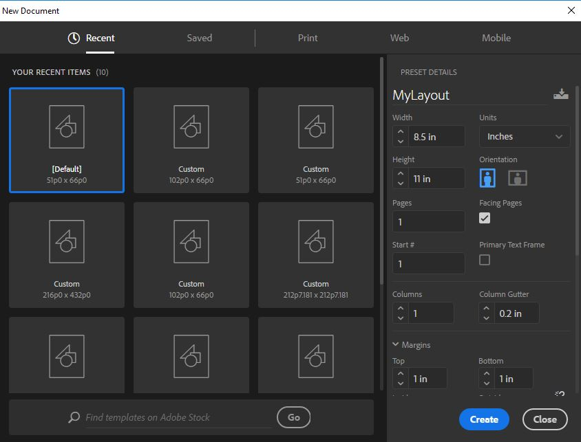
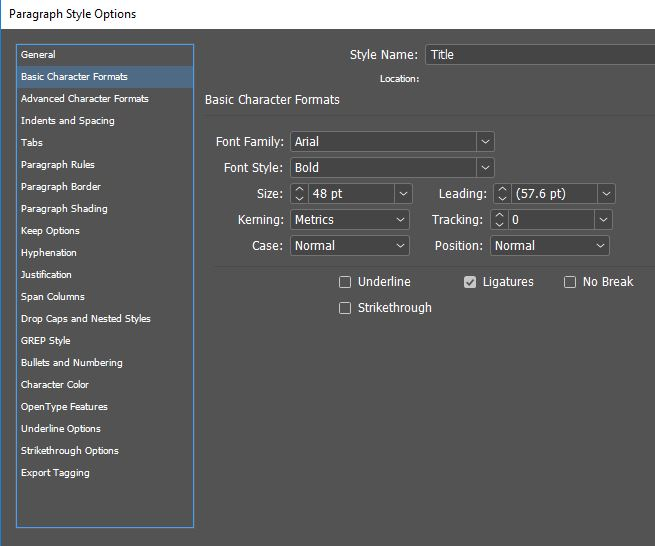
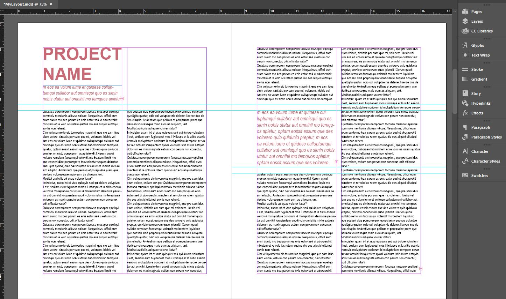
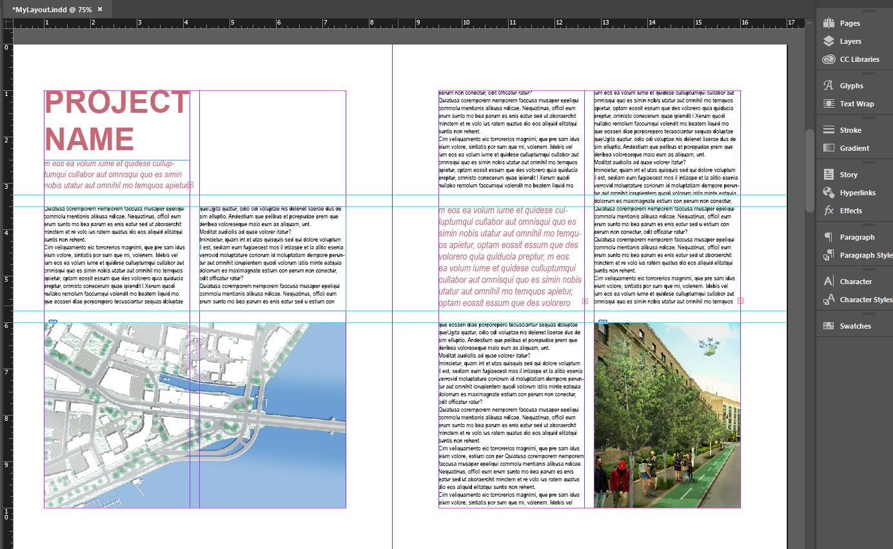

# Layout in InDesign
[Eric Huntley](@ehuntley) and [Yael Nidam](@yaelnidam)

InDesign is often used for preparing poster and book layouts. This tutorial will introduce you to some basic time-saving features that will help you get started with your own poster or portfolio.

### File for This Exercise
You can follow this tutorial using any images you like, or download the images used in this tutorial from here:
You can also download the final InDesign file from here:

## Document Setup

File -> New Document. This is where you define the basic setup of your document. At any time, you can change these definitions through file->Document Setup. For this exercise, define:
- units: inches
- Height: 11
- Width: 8.5
- Pages: 10
- Orientation: portrait
- Check the box for "Facing Pages".
- Columns:2
- Column Gutter: 0.2 inches
- Margins: 1 inch (all)
- Bleed**: 0 inch (all)
- Slug: 0 inch (all)

** This tutorial will not cover bleed, but if you want to learn out more about it checkout [this tutorial](https://indesignsecrets.com/indesign-basics-bleeds-in-indesign.php). It's useful if you want
to print a page with color extending (bleeding) to the edge of the paper.

Next, Choose your work space. go to window -> workspace -> [Typography]. This setup includes the tools we'll be using today: pages, layers, stroke, paragraph styles, character styles.

## Add Text and Define Paragraph Style

Defining paragraph styles is the professional way to use InDesign. Although it may take some time at first, it saves much more time down the line. It enables you control over all the elements in the document that were defined with a specific paragraph style. This means that at any time you can change formatting from the paragraph style menu.

1. Use the type tool (t) from the left panel to create 4 new text boxes and enter a different text to each box:
- "Title"
- "Subtitle"
- "Text"

2. Define Paragraph Style: Click on the Paragraph Style icon in the right panel. A pop up window will open, Click on the "create new style" icon at the bottom right to create a new paragraph style. Double click on the style for editing options.

Make sure to name your style and to define font, size, and color.

3. Repeat process to define 4 styles:
- "Title" : Font size 48
- "Subtitle" : Font size 14
- "Text": : Font size 10

4. To apply style to a text box, click on at text and than choose the desired style from the paragraph style menu.

## Use Grid and Guides to Organize Layout

Using grid is a quick way to create an organized layout. Every element on the InDesign artboard has x,y location and w,h measurements. This is helpful to remember if you need a few elements the same size. Addionally, you can drag guidelines from the top and left rules to help you organize the layout.

Design tips:
- Use the same gap for vertical and horizontal division.
- Use same size text boxes when possible.

## Add Images

Drag and drop images into the InDesign artboard. One click on the image will let you add the frame size and location. Double click on the image will let edit size and scale.

