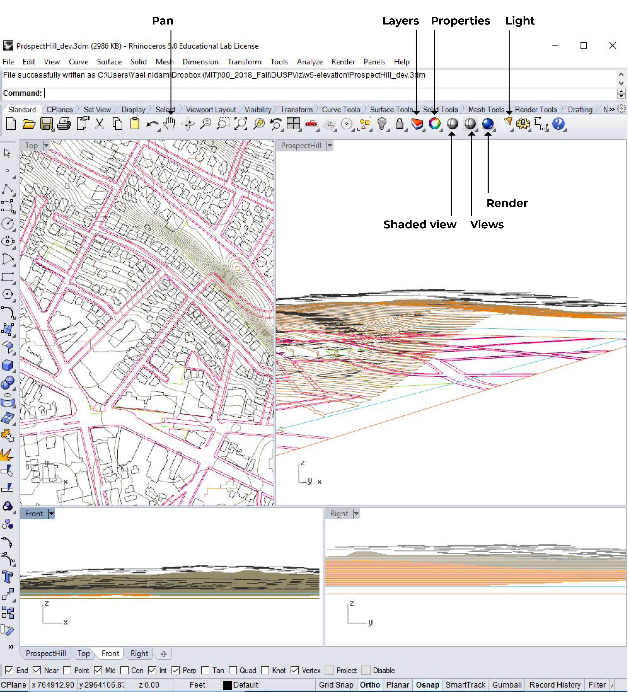

# 3D model - 2/3 Rhino to Illustrator
[Eric Huntley](@ehuntley) and [Yael Nidam](@yaelnidam)

This set of three tutorials will utilize GIS data to create a 3d model in rhino and final graphic editing in Illustrator.

### File for This Exercise
Download the Rhino file for this exercise from here:

Your initial model should look like this:

## Rhino Layers
In part 1/3 we exported GIS Layers to Rhino.
Now, Open Rhino and checkout the layers:
1. BuildingFootprints_Contours2
2. ContoursPolygon_Elev2
3. Somerville_openSpace
4. Somerville_sidewalk
5. Study_area_05
6. contours_clip

You will see that (1) BuildingFootprints_Contours2 places each building polygon at the exact top height it should reach. (2) ContoursPolygon_Elev2 is a layer that contains a separate polygon for each topography level. This will be a good layer if we wanted to laser cut the topography, but it's not the best choice for a 3d topography because it will create a terraced model. We exported this layer so you can see the difference between this layer and contours_clip, which includes one topography line for each level. And lastly, both Somerville_sidewalk and Somerville_openSpace are placed at zero elevation and will need to be projected onto the topography.

## Generate topography

### 1. Create a new layer named Topography
- Go to the layers' menu and click on the new layer icon.
- Double click on the layer to rename it to Topography.
- Under the V column, double click the Topography row so that the V for current layer will be on Topography.

### 2. Turn off all layers but contours_clip
In the layers' menu and turn off the light icon for all layers but contours_clip

### 3. Select all topography polygons
- Choose one of the 4 views (either top, perspective, front or right).
- Zoom out (scroll out) until you see all polygons.
- Left click to select all polygons, release click only when you have finished selection. Notice that if you move your mouse to the left, the selection rectangle is a continues line and will only select objects inside the line. If you more your mouse left during selection, the selection line will be broken and the selection will include any object that crosses the line as well as all the objects inscribed.
- You will see all selected objects will change color to yellow

### 4 . Use Patch to create 3d topography
In the command line print: patch
Define:
- Sample point spacing: 0.5
- Surface U spans: 50
- Surface V spans: 50
- Stiffness: 2

Check boxes for Adjust tangency and automatic trim.

Congrats! You have topography!

## Project Sidewalks and open space to topography

### 1. Adjust Layers
- Create a new layer named 3Dsidewalk and make it the current layer.
- Turn on Somerville_sidewalk.
- Lock all layers but 3Dsidewalk and Somerville_sidewalk.

### 2. Project sidewalks to Topography
- In the command line print: project
- The command line will prompt you to select curves and points to project. Select all sidewalk polylines and press enter.
- The command line will now prompt you to select the surfaces you wish to project onto. Go to the layers menu and unlock Topography layer. Select the topography we  just created and press enter.
- Congrats! You now have 3d sidewalks.

### 3. Repeat steps 1-2 to project open spaces onto topography.

## Create 3D Building

This step will demonstrate why part 1/3 GIS to Rhino tutorial was so helpful.

### 1. Adjust Layers
- Create a new layer named 3Dbuildings and make it the current layer.
- Turn on BuildingFootprints_Contours2.
- Lock all layers but BuildingFootprints_Contours2 and 3Dbuildings.

### 2. Use extrude to create building volume
- In the command line, print: extrudecrv and press enter
- Choose all buildings and press enter
- In the command line, click on ToBoundry and choose the topography layer (you have to unlock it first).
- in the command line print: 30 and enter.

### 3. If stage 2 fails to produce 3d buildings, follow this step
- In the command line, print: extrudecrv and press enter
- Choose all buildings and press enter
- in the command line print: -30
- In this case we choose -30 because we know our tallest building is 30 feet. In other models always choose the tallest elevation so that the tallest building will touch the ground.

### 4. Optional: Use Boolean difference to remove building area underneath Topography
- Duplicate Topography layer. Create a new layer called: topo-copy. Use the copy command to duplicate 3d topography. use the properties menu to place the duplicated version in the topo-copy layer.
- In the command line type: BooleanDifference
- Select surfaces/polysurfaces to subtract from - choose all 3Dbuildings and press enter.
- Select surfaces to substract with - Choose topo-copy.
- Wait 1-2 minutes for the computer to finish processing.

## Export to Illustrator.
File - Export - Export to illustrator.
