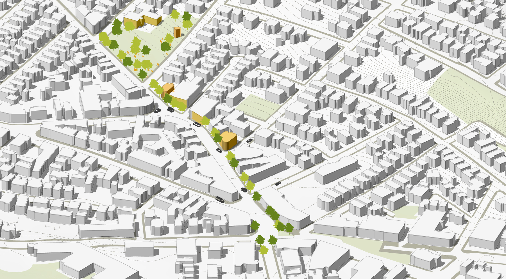

# 3D model - 3/3 Illustrator 3D Diagram
[Eric Huntley](@ehuntley) and [Yael Nidam](@yaelnidam)

This set of three tutorials will utilize GIS data to create a 3d model in rhino and final graphic editing in Illustrator.

### File for This Exercise
Download the Rhino file for this exercise from here:

Your initial model should look like this:

## Illustrator Layers

In part 2/3 we exported Rhino Layers to Illustrator.
Now, Open Illustrator and checkout the layers:
- Viewport Boundary
- Study_area_05
- contours_clip
- 3DOpenSpace
- 3Dsidewalk
- 3DBuildings

In addition, we exported 2 rendered views and a 2D-Buildings layer. These need to be imported (drag and drop) into the main file and scaled. For your convenience, the base file already includes these layers after they have been scaled and put in place.

Therefore, the base illustrator file also includes these layers:
- Shade - Rendered view of buildings + topography
- Building - Rendered view of the buildings layer alone.
- 2D Buildings - The linework produced after applying the make2d function on the 3D buildings in rhino.

Additionally, you'll see a bonus layer called Added Elements, which includes trees, people and cars to populate this diagram.

## Adjust Stroke and Color

### 1. Turn off all layers
Go to the layers menu (View -> layers) and turn off all the layers by clicking on the eye icon next to each layer.

### 2. Adjust features layer by layer
Make the following adjustments to these layers:
- 3DOpenSpace - Fill color: Green (suggested: E7EDD1), Stroke: None.
- 3Dsidewalk - Fill color: Grey (suggested: BAB9A8), Stroke: None.
- contours_clip - Fill color: None, Stroke: Brown ((suggested: 9E9A8F), Created dashed line with 2pt dash, 1pt gap. Stroke Weight: 0.15.
- 2DBuildings - Fill color: None, Stroke: Black, Stroke Weight: 0.25.

Follow this workflow:
1. Turn layer on by clicking on the left box next to the layer's name. You will see an eye icon populating the box.
2. Select all items on layer by clicking on the Layer's circle in the layer's menu.
3. Use the Fill/Stroke tool at the bottom of the left panel to set Fill/Stroke. The top left is Fill and the bottom right is Stroke.
4. If you added stroke, you will see a stroke bar at the top panel.
Click on the word Stroke, a new pop up window will open where you can adjust dashed lines. Next to the word stroke is the line weight, it usually defaults to 1pt, adjust to your needs. Another way to reach the stroke menu: window -> Stroke.
5. Lock layer by clicking on the right box next to the layer's name. You will see a lock icon populating the box.

Congrats! You finished the initial set up!

## Edit Buildings
Rhino exports 3D objects as wireframe curves. This is why the 3DBuildigns layer isn't helpful for representation and its main function is help us place the rendered buildings in the correct scale and location. The following workflow will provide guidance on how to use the rendered images to solve this challenge.

### 1. Trace Building
1. Turn on the buildings layer which contains a rhino generated render of the buildings layer only as a jpeg.
2. select layer + Click on the small arrow by the Image Trace menu on the top panel.
3. In the Pop-up Image Trace menu choose: high fidelity image and trace. This will produce polygons corresponding for each color on the image, including white.
4. Select layers, right click and choose Ungroup layers (ctrl+shift+G). Exit selection.
5. Create a layer that will help us differentiate between the buildings and the background. In the layers menu, create a new layer named: background. Use the Rectangle Toll (m) on the left panel to draw a rectangle the size of the viewport. Choose fill color: bright red. Place layer at the bottom of the layers and lock.
6. Get rid of the white background - Select one of the white polygons and go to the top bar ->select-> same -> Fill color. This command will select all other white polygons, erase them by clicking delete. Repeat process as necessary until all white space between buildings is erased.
7. Name this layer: Buildings-Shaded.

### 2. Adjust buildings

1. Duplicate Buildings-Shaded by dragging this layer to the new layer icon in the layers menu.
2. Name duplicated layer: Buildings-white.
3. Change layer order so that Buildings-white is Underneath Buildings-Shaded.
4. Lock layer.
5. Select Buildings-Shaded and click on Opacity in the top panel. In the pop-up click on the arrow to choose: Multiply (instead of normal) and adjust opacity to 50%.
6. Lock layer.

### 3. Adjust environment shadow
1. Select shade layer which contains a rendered image from rhino of Buildings + Topography.
2. Click on Opacity in the top panel. In the pop-up click on the arrow to choose: Multiply (instead of normal) and adjust opacity to 50%.

## Adjust Layer Order

Illustrator stacks successively drawn objects, beginning with the first object drawn. Change your layer order to the following:

- Viewport Boundary
- Added Elements
- 2D Buildings
- Buildings-Shaded
- Buildings-White
- Shade
- contours_clip
- 3DOpenSpace
- 3Dsidewalk
- 3DBuildings
- Study_area_05
- Background

Make sure all layers are locked and layers 10-12 are turned off.

## Add Elements

The added elements layer contains groups for 3 different elements:
- Cars
- Trees
- People

To start the process unlock the Add Elements group and Lock the individual layers. For each element, follow this workflow:
1. Unlock layer.
2. Select layer and scale all elements to appropriate size. Use shift to maintain proportions.
3. Change Fill/Stroke if necessary.
4. Place in drawing. Duplicate items by selecting the object you wish to duplicate + press Alt + drag to where you want to locate the duplicate.
5. When done lock layer.

## Adjust Canvas Size and Export

1. Click on the Artboard Tool at the bottom of the left panel.
2. Adjust artboard to view you wish to export.
3. Alternatively, create an artboard in the exact size you want and scale drawing to artboard.
4. To scale drawing to Artboard:
- Unlock all Layers
- Select all Layers
- Scale to the desired size.
5. Export: File -> Export -> Export as -> Choose type and check the box for Use Artboard, select the artboard you wish to export -> OK.

